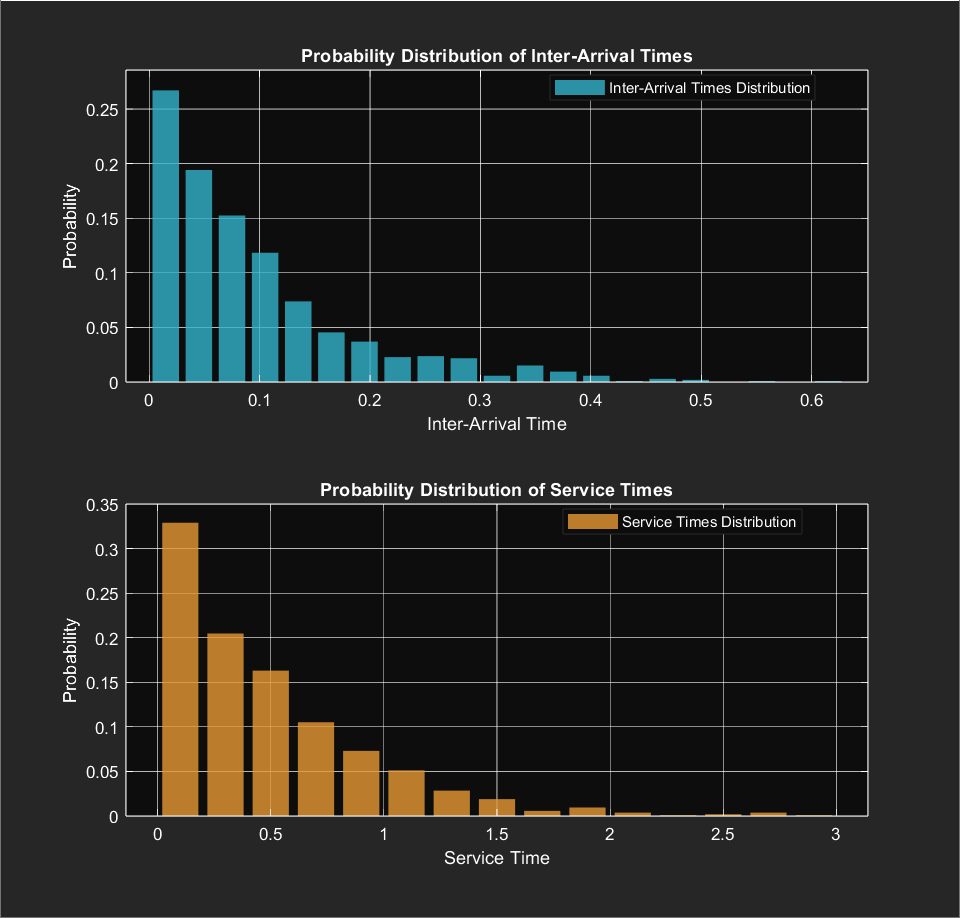

<div align="center">
  
  
</div>

---

### Overview

This repository implements a simulation of an **M/M/∞ queueing model**, a foundational model in queueing theory used to study systems with unlimited service capacity.

The M/M/∞ model is defined by:
- **M** (Markovian Inter-Arrival Times): The time between successive arrivals follows an exponential distribution.
- **M** (Markovian Service Times): The service times are exponentially distributed.
- **∞** (Infinite Servers): Every arriving entity is immediately served without delay, as there are unlimited servers available.

The model is commonly used to simulate systems where resources are abundant compared to demand, such as cloud computing or large-scale server farms.

---

### Events in the Simulation

The simulation revolves around two types of **events**:
1. **Arrival Event:** A new call enters the system. It is immediately assigned to a server. Each arrival event generates the next arrival time (`next_arrival_time`) by sampling from the exponential inter-arrival time distribution.
2. **Departure Event:** A call completes its service and leaves the system.

Each event updates the system state, including the current number of active calls (`num_calls`) and the time (`current_time`).

---

### Event Determination Process

At any point, the simulation determines which event (arrival or departure) occurs next:
  - **Arrival Time:** Calculated as the current time plus a random inter-arrival time (`exprnd(1 / lambda)`). This is updated every time an arrival event occurs.
  - **Departure Time:** The earliest scheduled departure time from the `scheduled_departure_times` list.

The simulation compares the next arrival time (`next_arrival_time`) and the earliest departure time (`min(scheduled_departure_times)`) to decide:
- If the arrival time is sooner, an **arrival event** occurs:
  - Updates the number of active calls (`num_calls`).
  - Schedules a departure for the arriving call.
  - Determines the next arrival time by sampling a new inter-arrival time.
- Otherwise, a **departure event** occurs:
  - Reduces the number of active calls (`num_calls`).
  - Removes the completed departure from the schedule.

---

### Simulation Parameters

- **Arrival Rate (λ):** The average number of arrivals per unit time.
- **Service Rate (μ):** The average number of services completed per unit time.
- **Total Time:** The duration of the simulation.

```matlab
lambda = 10       % arrivals / unit time
mu = 2            % services / unit time
total_time = 100  % units
```
---

### Process Flow

1. Start the simulation clock at `current_time = 0`.
2. Generate the first arrival event and initialize the system state:
   - Sample the time until the first arrival from the exponential distribution.
   - Log the initial system state (time and number of calls).
3. Iteratively process events by determining whether the next event is an **arrival** or **departure**:
   - Compare the time of the next arrival with the earliest departure.
   - Update the system state based on the type of event:
     - **Arrival Event:**
       - Increase the number of active calls.
       - Schedule a departure for the arriving call by sampling its service time.
       - Generate the next arrival time by sampling a new inter-arrival time.
     - **Departure Event:**
       - Decrease the number of active calls.
       - Remove the completed departure from the schedule.
   - Log the system state after each event (time and number of calls).
4. Continue until `current_time >= total_time`.

---

### Visualizations

#### Number of Calls in the System Over Time

This plot tracks the evolution of the number of active calls during the simulation. The orange line represents the number of active calls at each logged event. The red dashed line shows the time-weighted average number of calls, computed across the simulation duration.

<div align="center">
  
</div>

#### Probability Distribution of Calls in the System

This histogram displays the probability distribution of the number of active calls during the simulation. The distribution reflects the system's ability to handle all arriving calls due to infinite servers.

<div align="center">
  
</div>

#### Distributions of Inter-Arrival and Service Times

This plot provides two separate distributions:
1. **Inter-Arrival Times:** The time intervals between consecutive arrivals.
2. **Service Times:** The duration of service for each call.

Both distributions align with the expected exponential behavior, given the model assumptions.

<div align="center">
  
</div>

---

### Running the Simulation

1. Clone the repository:
   ```bash
   git clone https://github.com/mantvydasdeltuva/M_M_Infinity-Queue-Simulation.git
   cd M_M_Infinity-Queue-Simulation
2. Open the MATLAB script in the MATLAB editor.
3. Modify the parameters (lambda, mu, total_time) if needed.
4. Run the script to simulate and generate the visualizations.

---

### Dependencies

- MATLAB (Recommended version: R2023a or later).
- Statistics and Machine Learning Toolbox

---

### License

This project is licensed under the MIT License. See the LICENSE file for more details.

---

### Contributions

Contributions and suggestions are welcome. Please feel free to submit an issue or a pull request for improvements.